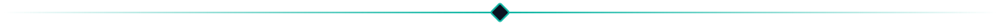
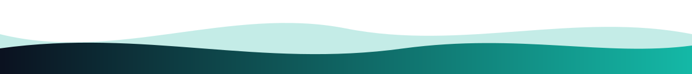

 

  

**Web** &nbsp;·&nbsp; **Mobile** &nbsp;·&nbsp; **IoT** &nbsp;·&nbsp; **Sistem Informasi**

<h2 align="center">Tentang Saya</h2>

Halo, saya <b>Imam</b>, mahasiswa Informatika Universitas Madura sekaligus <b>developer aplikasi web dan mobile</b>. 
Saya membangun produk digital yang utuh: dari rancangan database dan API, 
antarmuka yang bersih dan responsif, sampai aplikasi berjalan dan dipakai langsung oleh pengguna.

<i>Software yang baik itu sederhana, mudah dirawat, dan menyelesaikan masalah nyata.</i> 
Proyek saya berangkat dari kebutuhan lapangan: absensi, akademik, keuangan organisasi, hingga otomasi perangkat IoT.

<h2 align="center">Yang Saya Kerjakan</h2>

<table align="center">
  <tr>
    <td width="33%" valign="top" align="center">
      <h3>🌐 Aplikasi Web</h3>
      Sistem informasi, dashboard, dan panel admin dengan backend terstruktur, autentikasi aman, dan tampilan responsif.
    </td>
    <td width="33%" valign="top" align="center">
      <h3>📱 Aplikasi Mobile</h3>
      Aplikasi mobile yang terhubung ke REST API, dengan fokus pada pengalaman pengguna yang ringan dan mudah dipakai.
    </td>
    <td width="33%" valign="top" align="center">
      <h3>🔌 IoT &amp; Otomasi</h3>
      Perangkat berbasis ESP32 yang terhubung ke dashboard web, plus otomasi proses lewat Google Apps Script.
    </td>
  </tr>
</table>

<h2 align="center">Tech Stack</h2>

**Backend &amp; Database** 

**Frontend** 

**IoT, Otomasi &amp; Tools** 

<h2 align="center">Proyek Pilihan</h2>

<table align="center">
  <tr>
    <td width="50%" valign="top">
      <h3>AbsenSmart</h3>
      Aplikasi absensi mahasiswa berbasis web dengan rekap yang rapi dan mudah dipakai.  
      <code>Laravel</code> · <code>Bootstrap 5</code>
    </td>
    <td width="50%" valign="top">
      <h3>Bel Otomatis (dartaCode)</h3>
      Bel sekolah otomatis berbasis ESP32 lengkap dengan firmware dan dashboard pengaturan jadwal.  
      <code>ESP32</code> · <code>Web Dashboard</code>
    </td>
  </tr>
  <tr>
    <td width="50%" valign="top">
      <h3>SIATUNAM</h3>
      Sistem informasi akademik terpadu untuk kebutuhan perguruan tinggi.  
      <code>Web</code> · <code>MySQL</code>
    </td>
    <td width="50%" valign="top">
      <h3>Sistem Keuangan FKMSB DPK UNIRA</h3>
      Pencatatan dan pelaporan keuangan organisasi mahasiswa secara terotomasi.  
      <code>Google Apps Script</code> · <code>Sheets</code>
    </td>
  </tr>
</table>

<h2 align="center">Mari Berkolaborasi</h2>

Punya ide aplikasi web, mobile, atau sistem IoT? 
Saya terbuka untuk kolaborasi dan diskusi.

  

<i>Kode yang baik itu tenang: mudah dibaca, mudah dirawat, dan bikin hidup orang lain lebih ringan.</i>

